# EShop — Bug Report

Bugs found by executing the domain-testing + BVA suite (`docs/test-design-report.md`, 124 cases)
plus supplemental gap cases (`FR10-ADM-01`, `FR10-SEC-01`, `FR14-INTEG-01`), against the backend at
commit `6cdd618`. **Oracle = `README.md`.** Each bug traces to failing case IDs in
`docs/test-results.md` and `tests/results.json`.

**17 bugs** across 17 GitHub issues — **2 Critical · 7 High · 2 Medium · 6 Low**. Severity-ordered.
(The former GUI bundle BUG-11 was split into 5 separate issues: BUG-11 + BUG-14…17.)

| # | Sev | Feature | Title | Cases | Issue |
|---|-----|---------|-------|-------|-------|
| BUG-04 | Critical | FR-05 | SQL injection & LIKE-wildcard leak in product search | 5 | [#1](https://github.com/linhkhoi1309/eshop-sut/issues/1) |
| BUG-10 | Critical | FR-05 | Reflected XSS in web search (`dangerouslySetInnerHTML`) | 4 | [#10](https://github.com/linhkhoi1309/eshop-sut/issues/10) |
| BUG-01 | High | FR-09 | Coupon rejected when total exactly equals the minimum (`>` vs `>=`) | 5 | [#2](https://github.com/linhkhoi1309/eshop-sut/issues/2) |
| BUG-02 | High | FR-09 | Percent discount formula wrong → negative discount | 3 | [#3](https://github.com/linhkhoi1309/eshop-sut/issues/3) |
| BUG-03 | High | FR-09 | Coupon applies without login (C4 not enforced) | 1 | [#4](https://github.com/linhkhoi1309/eshop-sut/issues/4) |
| BUG-06 | High | FR-14 | Category write endpoints accept a non-admin token (SEC-03) | 3 | [#5](https://github.com/linhkhoi1309/eshop-sut/issues/5) |
| BUG-07 | High | FR-10 | Server lets a user cancel a `shipping` order | 2 | [#6](https://github.com/linhkhoi1309/eshop-sut/issues/6) |
| BUG-08 | High | FR-10 | Admin can move a `canceled` order to `delivered` (final-state) | 1 | [#8](https://github.com/linhkhoi1309/eshop-sut/issues/8) |
| BUG-13 | High | FR-10 | Non-admin can change order status (missing role check, SEC-03) | 1 | [#13](https://github.com/linhkhoi1309/eshop-sut/issues/13) |
| BUG-05 | Medium | FR-14 | Empty / whitespace category name accepted | 4 | [#7](https://github.com/linhkhoi1309/eshop-sut/issues/7) |
| BUG-09 | Medium | FR-14 | Deleting a category orphans its products (FR-15 integrity) | 1 | [#9](https://github.com/linhkhoi1309/eshop-sut/issues/9) |
| BUG-11 | Low | FR-05 | Listing page has two `<h1>` (should be exactly one) | 1 | [#11](https://github.com/linhkhoi1309/eshop-sut/issues/11) |
| BUG-14 | Low | FR-05 | Product images have empty `alt` attribute | 1 | [#15](https://github.com/linhkhoi1309/eshop-sut/issues/15) |
| BUG-15 | Low | FR-05 | Price shows "VND" instead of the `₫` symbol | 1 | [#16](https://github.com/linhkhoi1309/eshop-sut/issues/16) |
| BUG-16 | Low | FR-05 | No loading state while fetching products | 1 | [#17](https://github.com/linhkhoi1309/eshop-sut/issues/17) |
| BUG-17 | Low | FR-05 | No empty-state message when search returns no results | 1 | [#18](https://github.com/linhkhoi1309/eshop-sut/issues/18) |
| BUG-12 | Low | FR-09 | Coupon code lookup is case-sensitive (`save10` ≠ `SAVE10`) | 1 | [#12](https://github.com/linhkhoi1309/eshop-sut/issues/12) |

> **Environment (all bugs):** backend `http://localhost:3000`, seed DB (fresh on boot).
> Accounts: admin `admin@eshop.com/Admin123!`, user `test@eshop.com/Test1234!` (id 2).
> **Screenshots:** each bug's evidence image is embedded in its section below from
> `evidence/bug-0X.png` (the same screenshots are attached to the corresponding GitHub issues).

---

## BUG-04 — [FR-05] SQL injection & LIKE-wildcard leak in product search
- **Severity:** Critical
- **Spec:** FR-05 R4 (search **by name**), R5 (term rendered safely), **SEC-05** (parameterised
  queries — no string concatenation), SEC-04.
- **Preconditions:** seed DB (5 products).
- **Steps (cURL):**
  ```bash
  curl -s "http://localhost:3000/api/products?search=%25"                 # %25 = a literal '%'
  curl -s "http://localhost:3000/api/products?search=' OR '1'='1"
  curl -s "http://localhost:3000/api/products?search=Mac_ook"
  ```
- **Expected:** each is a *literal* name search → **0 results** (no product name contains `%`,
  `' OR '1'='1`, or `Mac_ook`).
- **Actual:** `%` → **all 5 products**; `' OR '1'='1` → **all 5**; `Mac_ook` → **MacBook Pro M3**
  (the `_` acted as a SQL wildcard). The query is built by string concatenation, so `%`, `_`, `'`
  are interpreted as SQL, not treated as literals — a working SQL-injection / data-leak vector.
- **Evidence:** 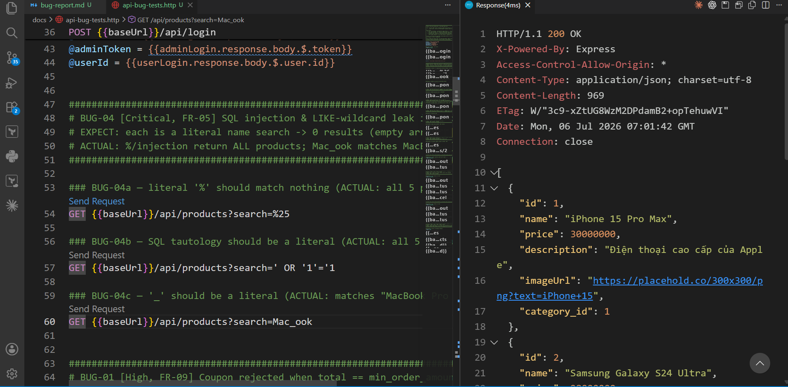
- **Traceability:** `FR05-DT-12`, `FR05-DT-13`, `FR05-BVA-10`, `FR05-BVA-11`, `FR05-BVA-12`.

---

## BUG-01 — [FR-09] Coupon rejected when order total exactly equals the minimum
- **Severity:** High
- **Spec:** FR-09 **C3** — "Tổng đơn hàng **>= (lớn hơn hoặc bằng)** `min_order_amount`".
- **Preconditions:** logged-in user (id 2); coupon `SAVE10` (min 300,000).
- **Steps (cURL):**
  ```bash
  curl -s -X POST http://localhost:3000/api/apply-coupon \
    -H "Content-Type: application/json" \
    -d '{"code":"SAVE10","total_amount":300000,"user_id":2}'
  ```
- **Expected:** coupon **applies** at exactly the minimum (discount 30,000; final 270,000).
- **Actual:** `400 {"error":"Đơn hàng chưa đủ giá trị tối thiểu 300,000 ₫ …"}`. The check uses
  `total_amount > min_order_amount` (strict `>`) instead of `>=`, so an order *equal* to the
  minimum is wrongly rejected. Reproduced for BIGBUY (500,000) and VIP100 (300,000).
- **Evidence:** 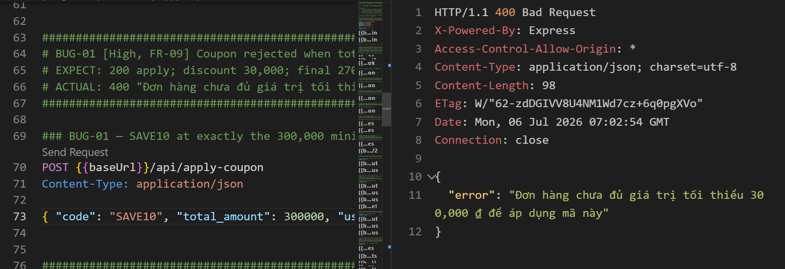
- **Traceability:** `FR09-BVA-02`, `FR09-BVA-05`, `FR09-BVA-08`, `FR09-DT-01`, `FR09-DT-02`.

---

## BUG-02 — [FR-09] Percent discount formula wrong → negative discount / inflated total
- **Severity:** High
- **Spec:** FR-09 — percent: `discount_amount = total × discount_value / 100`;
  `final_amount = total − discount_amount`.
- **Preconditions:** logged-in user; coupon `SAVE10` (percent 10).
- **Steps (cURL):**
  ```bash
  curl -s -X POST http://localhost:3000/api/apply-coupon \
    -H "Content-Type: application/json" \
    -d '{"code":"SAVE10","total_amount":1000000,"user_id":2}'
  ```
- **Expected:** discount 100,000; final 900,000.
- **Actual:** `200 {"discount_amount":-9000000,"final_amount":10000000}`. The code computes
  `discount = floor(total × (1 − discount_value))` (treating `discount_value=10` as a fraction),
  producing a large **negative** discount and a final **larger** than the order total.
- **Evidence:** 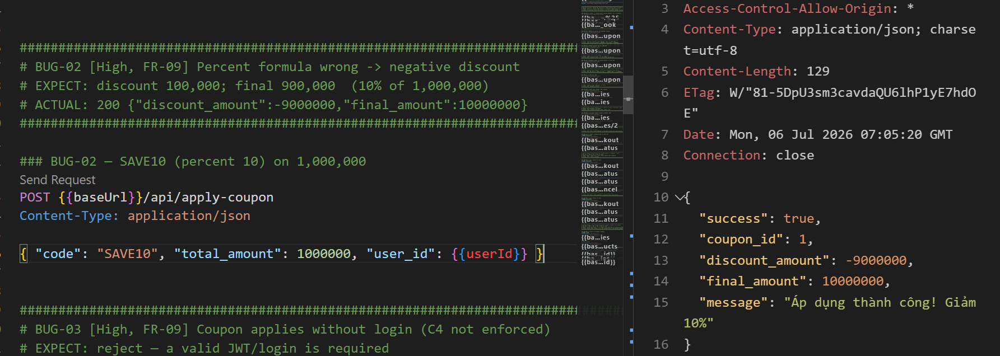
- **Traceability:** `FR09-DT-17`, `FR09-BVA-03`, `FR09-BVA-22`.

---

## BUG-03 — [FR-09] Coupon applies without login (C4 not enforced)
- **Severity:** High
- **Spec:** FR-09 **C4** (user must be logged in) / **SEC-02** (secured APIs require a valid JWT).
- **Preconditions:** none (anonymous).
- **Steps (cURL):**
  ```bash
  curl -s -X POST http://localhost:3000/api/apply-coupon \
    -H "Content-Type: application/json" \
    -d '{"code":"SAVE10","total_amount":500000}'          # no token, no user_id
  ```
- **Expected:** reject — a valid login/JWT is required (C4).
- **Actual:** `200 {"success":true,...}` — the coupon is applied for an anonymous request. The
  endpoint has no auth middleware and treats `user_id` as optional, which also **bypasses the
  per-user usage cap (C5)** since usage cannot be attributed.
- **Evidence:** 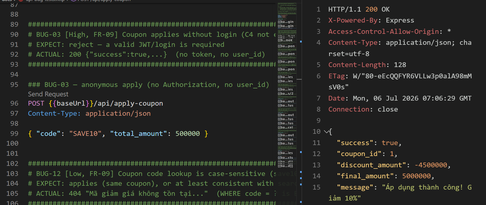
- **Traceability:** `FR09-DT-09` (and see BUG-01 note re `FR09-DT-16`).

---

## BUG-06 — [FR-14] Category write endpoints accept a non-admin token (missing role check)
- **Severity:** High
- **Spec:** FR-12 / **SEC-03** — admin APIs and `POST/PUT/DELETE /api/categories` must require a
  valid JWT **and** `role='admin'`, not merely the presence of a token.
- **Preconditions:** log in as the normal user to get a non-admin token.
- **Steps (cURL):**
  ```bash
  TOKEN=$(curl -s -X POST http://localhost:3000/api/login -H "Content-Type: application/json" \
    -d '{"email":"test@eshop.com","password":"Test1234!"}' | sed -E 's/.*"token":"([^"]+)".*/\1/')
  curl -s -o /dev/null -w "%{http_code}\n" -X POST http://localhost:3000/api/categories \
    -H "Authorization: Bearer $TOKEN" -H "Content-Type: application/json" -d '{"name":"Hacked"}'
  curl -s -o /dev/null -w "%{http_code}\n" -X DELETE http://localhost:3000/api/categories/2 \
    -H "Authorization: Bearer $TOKEN"
  ```
- **Expected:** `403 Forbidden` (non-admin).
- **Actual:** `200` for both create and delete. `authenticateToken` verifies the JWT but never
  checks `role`, so any logged-in user can manage categories.
- **Evidence:** 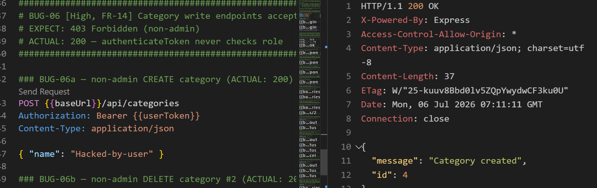
- **Traceability:** `FR14-DT-05`, `FR14-DT-07`, `FR14-DT-14`.

---

## BUG-07 — [FR-10 / Mobile] Server lets a user cancel a `shipping` order
- **Severity:** High
- **Spec:** FR-10 — when an order is `shipping`, the **User may NOT self-cancel** (admin only);
  FR-20 — mobile cancel only when `pending`/`confirmed`.
- **Preconditions:** an order owned by the user, driven to `shipping` (via admin API).
- **Steps (cURL):**
  ```bash
  U=$(curl -s -X POST http://localhost:3000/api/login -H "Content-Type: application/json" \
     -d '{"email":"test@eshop.com","password":"Test1234!"}' | sed -E 's/.*"token":"([^"]+)".*/\1/')
  A=$(curl -s -X POST http://localhost:3000/api/login -H "Content-Type: application/json" \
     -d '{"email":"admin@eshop.com","password":"Admin123!"}' | sed -E 's/.*"token":"([^"]+)".*/\1/')
  OID=$(curl -s -X POST http://localhost:3000/api/checkout -H "Authorization: Bearer $U" \
     -H "Content-Type: application/json" -d '{"total_amount":100000,"shipping_address":"x"}' \
     | sed -E 's/.*"orderId":([0-9]+).*/\1/')
  curl -s -X PUT http://localhost:3000/api/admin/orders/$OID/status -H "Authorization: Bearer $A" \
     -H "Content-Type: application/json" -d '{"status":"confirmed"}' >/dev/null
  curl -s -X PUT http://localhost:3000/api/admin/orders/$OID/status -H "Authorization: Bearer $A" \
     -H "Content-Type: application/json" -d '{"status":"shipping"}' >/dev/null
  curl -s -o /dev/null -w "%{http_code}\n" -X PUT http://localhost:3000/api/orders/$OID/cancel \
     -H "Authorization: Bearer $U"                       # user cancels the shipping order
  ```
- **Expected:** reject (4xx) — user cannot cancel once `shipping`.
- **Actual:** `200` — the cancel succeeds. `/api/orders/:id/cancel` only rejects `delivered` /
  `canceled`; `shipping` falls through and is cancelled. The mobile UI hides the button (L1), so
  this defect is only visible at the **API layer (L2)**.
- **Evidence:** 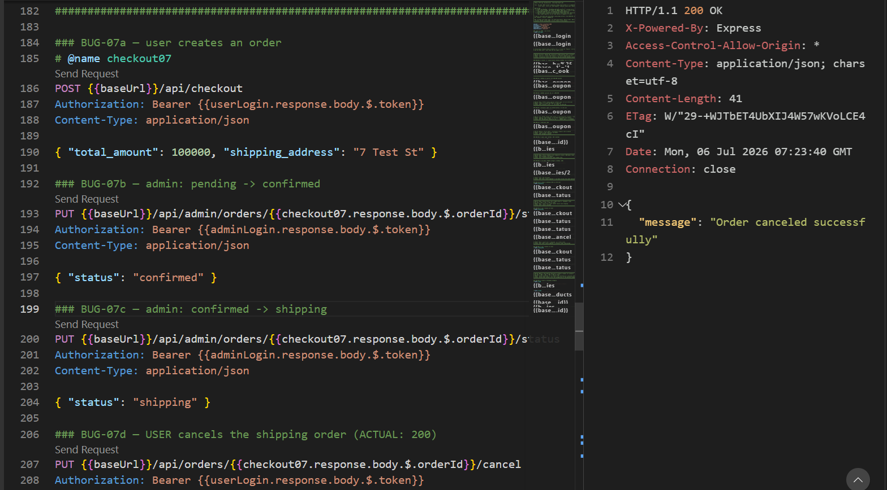
- **Traceability:** `FR10-DT-07`, `FR10-BVA-06`.

---

## BUG-05 — [FR-14] Empty / whitespace category name accepted
- **Severity:** Medium
- **Spec:** FR-14 — "Tên danh mục là bắt buộc, không được để trống" (name required, non-empty).
- **Preconditions:** admin token.
- **Steps (cURL):**
  ```bash
  A=$(curl -s -X POST http://localhost:3000/api/login -H "Content-Type: application/json" \
     -d '{"email":"admin@eshop.com","password":"Admin123!"}' | sed -E 's/.*"token":"([^"]+)".*/\1/')
  curl -s -o /dev/null -w "%{http_code}\n" -X POST http://localhost:3000/api/categories \
     -H "Authorization: Bearer $A" -H "Content-Type: application/json" -d '{"name":""}'
  curl -s -o /dev/null -w "%{http_code}\n" -X POST http://localhost:3000/api/categories \
     -H "Authorization: Bearer $A" -H "Content-Type: application/json" -d '{"name":"   "}'
  ```
- **Expected:** reject — name required, not empty.
- **Actual:** `200` — an empty (and whitespace-only) category is created. No non-empty validation.
- **Evidence:** 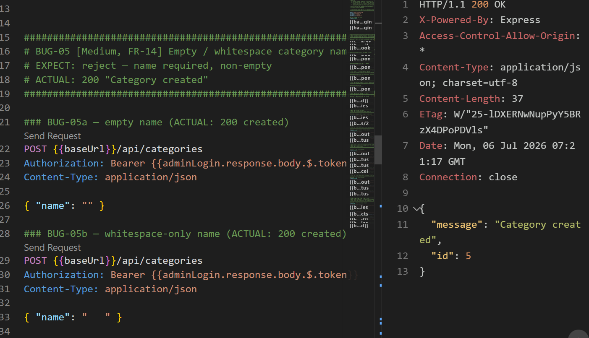
- **Traceability:** `FR14-DT-03`, `FR14-DT-04`, `FR14-BVA-01`, `FR14-BVA-04`.

---

## BUG-08 — [FR-10 / Admin] Admin can move a `canceled` order to `delivered`
- **Severity:** High
- **Spec:** FR-10 — `delivered` and `canceled` are **final states** (no transition out).
- **Preconditions:** a `canceled` order; admin token.
- **Steps (cURL):** checkout as user → admin sets `canceled` → admin sets `delivered`
  (full script in `docs/issues/bug-08.md`).
- **Expected:** reject (4xx) — `canceled` is terminal.
- **Actual:** `200 "Order status updated"`. The admin handler explicitly whitelists
  `canceled → delivered` (`if (currentStatus === "canceled" && status === "delivered")
  isValidTransition = true;`), resurrecting a terminal order (can also inflate delivered-revenue).
- **Evidence:** 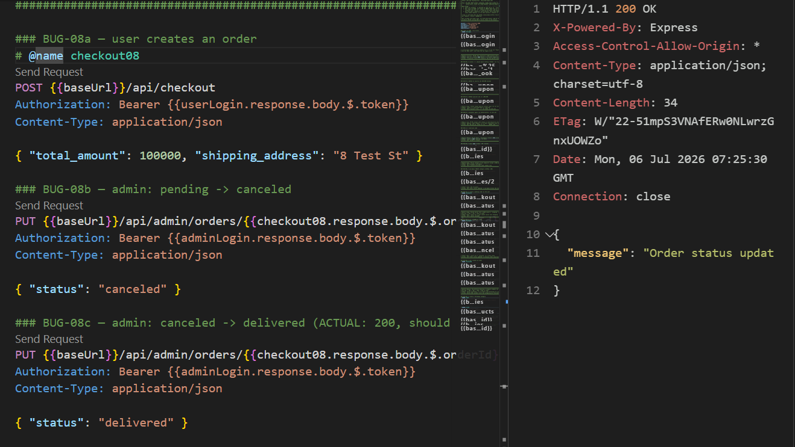
- **Traceability:** `FR10-ADM-01` (controls `FR10-ADM-02`, `FR10-ADM-03` pass).
- **Note:** this is the admin-side final-state defect the FR-10 *mobile* redesign stopped covering;
  re-added as an admin auto-case.

---

## BUG-09 — [FR-14 / FR-15] Deleting a category orphans its products
- **Severity:** Medium
- **Spec:** FR-15 — a product's category "phải chọn từ danh sách có sẵn" (must reference a valid,
  available category). Deleting a category with no integrity guard breaks that invariant.
- **Preconditions:** admin token.
- **Steps (cURL):** create category → create a product in it → delete the category → the product
  still references the deleted id (full script in `docs/issues/bug-09.md`).
- **Expected:** delete prevented, or products reassigned/removed — no product left referencing a
  non-existent category.
- **Actual:** `DELETE` returns `200 "Category deleted"`; the product is **orphaned** (its
  `category_id` no longer exists in `GET /api/categories`). Silent data-integrity corruption.
- **Evidence:** 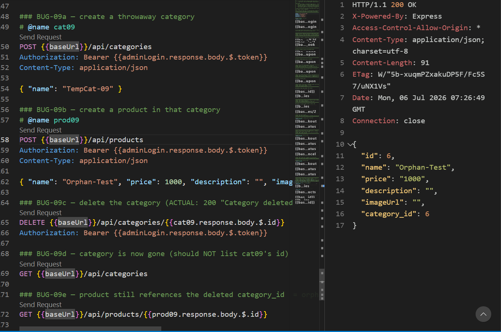
- **Traceability:** `FR14-INTEG-01`.

---

## BUG-10 — [FR-05] Reflected XSS in web product search
- **Severity:** Critical
- **Spec:** FR-05 R5 — search term "hiển thị an toàn (không render HTML)"; **SEC-04** — escape user
  input, no direct `innerHTML`.
- **Preconditions:** web app running (`:5173`).
- **Steps:** on the home page search `<b>hi</b>`, then ``.
- **Expected:** term shown as literal escaped text; no HTML rendered; no JS executes.
- **Actual:** the term is rendered via `dangerouslySetInnerHTML` (`frontend-web/src/pages/Home.jsx:64`).
  `<b>hi</b>` renders **bold**; `` **executes** → reflected XSS. Same unsafe
  render on the no-results view (`:61-66`) and on server error strings (`:68-72`).
- **Evidence:** 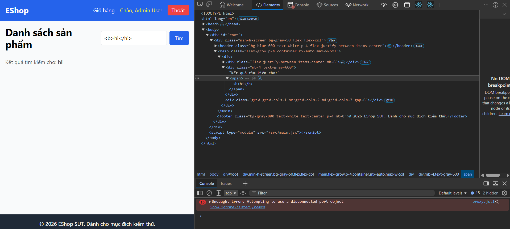
- **Traceability:** `FR05-DT-09`, `FR05-DT-10`, `FR05-DT-11`, `FR05-DT-17`. (Verified statically in
  `docs/manual-ui-verification.md`.)

---

> **FR-05 listing GUI defects (`frontend-web/src/pages/Home.jsx`)** — originally one bundle, now
> split into 5 separate Low issues (BUG-11, BUG-14, BUG-15, BUG-16, BUG-17).

## BUG-11 — [FR-05] Listing page has two `<h1>`
- **Severity:** Low · **Issue:** [#11](https://github.com/linhkhoi1309/eshop-sut/issues/11)
- **Spec:** FR-05 R8 / FR-21 — exactly one `<h1>` per page.
- **Actual:** `document.querySelectorAll('h1').length` → **2** ("Danh sách sản phẩm" `Home.jsx:43`
  + "Hiển thị N sản phẩm" `Home.jsx:110`).
- **Evidence:** 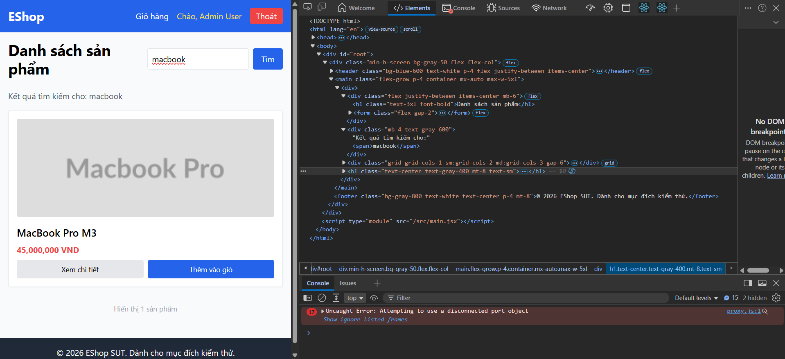 · **Traceability:** `FR05-DT-01` (h1 sub-check).

## BUG-14 — [FR-05] Product images have empty `alt`
- **Severity:** Low · **Issue:** [#15](https://github.com/linhkhoi1309/eshop-sut/issues/15)
- **Spec:** FR-05 R2 / FR-24 — descriptive, non-empty `alt`.
- **Actual:** `alt=""` on every product image (`Home.jsx:82`).
- **Evidence:** 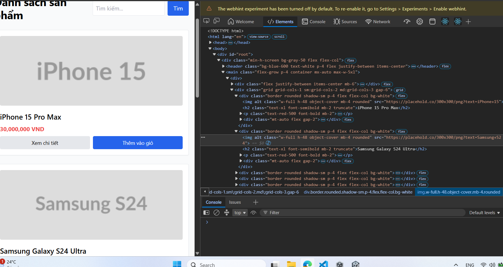 · **Traceability:** `FR05-DT-01` (alt sub-check).

## BUG-15 — [FR-05] Price shows "VND" instead of `₫`
- **Severity:** Low · **Issue:** [#16](https://github.com/linhkhoi1309/eshop-sut/issues/16)
- **Spec:** FR-05 R3 / FR-21 — use `₫` with thousands separator.
- **Actual:** shows `… VND` (`Home.jsx:87` — `{Number(p.price).toLocaleString()} VND`).
- **Evidence:** 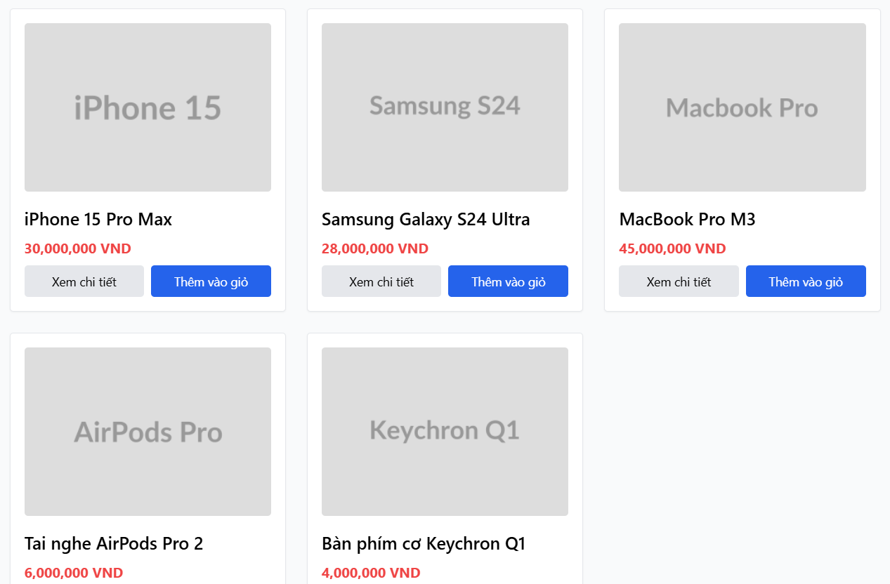 · **Traceability:** `FR05-DT-01` (price sub-check).

## BUG-16 — [FR-05] No loading state while fetching
- **Severity:** Low · **Issue:** [#17](https://github.com/linhkhoi1309/eshop-sut/issues/17)
- **Spec:** FR-05 R6 — show a loading state during fetch.
- **Actual:** no loading flag; nothing renders during the await (`Home.jsx:12-33`).
- **Evidence:** 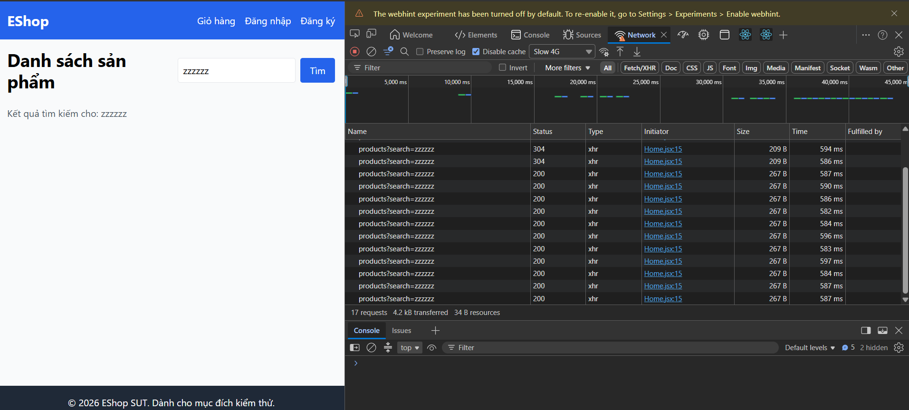 · **Traceability:** `FR05-DT-08`.

## BUG-17 — [FR-05] No empty-state message when search returns no results
- **Severity:** Low · **Issue:** [#18](https://github.com/linhkhoi1309/eshop-sut/issues/18)
- **Spec:** FR-05 R7 / FR-24 — "Khi không có kết quả tìm kiếm phải hiển thị thông báo empty state phù hợp".
- **Actual (browser-verified):** search `zzzzz` → 0 results, blank area, **no message**
  (`Home.jsx:74-107`; the status line `:109` is gated on `products.length > 0`).
- **Evidence:** 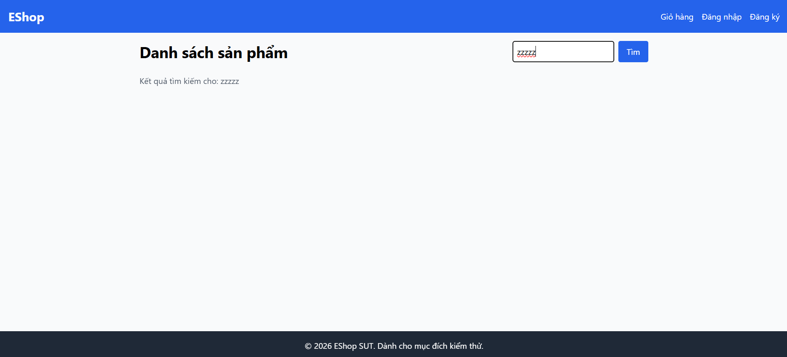 · **Traceability:** `FR05-DT-07`, `FR05-DT-16`.

---

## BUG-12 — [FR-09] Coupon code lookup is case-sensitive
- **Severity:** Low
- **Spec:** FR-09 — does not *mandate* case-insensitive codes, but the API is inconsistent with the
  case-insensitive product search and reports a valid coupon (different case) as non-existent.
- **Preconditions:** none (seeded `SAVE10`).
- **Steps (cURL):** `POST /api/apply-coupon {"code":"save10","total_amount":500000,"user_id":2}`.
- **Expected:** applies the coupon (`save10` = `SAVE10`), or at least consistent with the
  case-insensitive `LIKE` used by product search.
- **Actual:** `404 "Mã giảm giá không tồn tại…"`. The query `WHERE code = ?` uses SQLite's default
  **BINARY** collation, so `'save10' != 'SAVE10'`. Only masked in the UI because the frontends
  `.toUpperCase()` before sending (`frontend-mobile/App.js:366`). Fix: `WHERE code = ? COLLATE NOCASE`.
- **Evidence:** 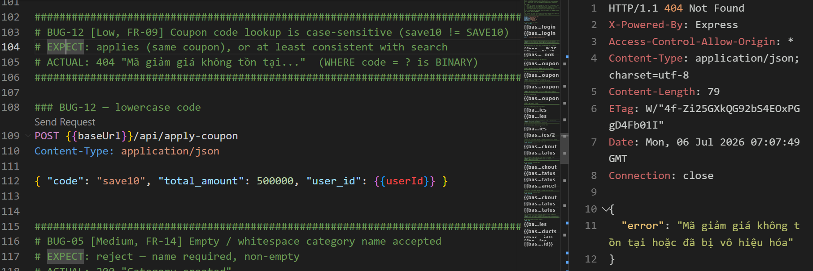
- **Traceability:** `FR09-DT-14` (contrast `FR05-DT-04`, where search *is* case-insensitive).

---

## BUG-13 — [FR-10] Non-admin can change order status (missing admin-role check)
- **Severity:** High
- **Spec:** FR-12 / **SEC-03** — `/api/admin/*` must require a valid JWT **and** `role='admin'`.
  `PUT /api/admin/orders/:id/status` drives the FR-10 state machine, so it must be admin-only.
- **Preconditions:** a normal (non-admin) user token; any order.
- **Steps (cURL):** login as user → checkout → `PUT /api/admin/orders/:id/status` with the **user**
  token (full script in `docs/issues/bug-13.md`).
- **Expected:** `403 Forbidden`.
- **Actual:** `200 "Order status updated"` — a normal user can move any order through the state
  machine. Route uses `authenticateToken` only (`server.js:525`), no role check. Same class as
  BUG-06; `GET /api/admin/orders` (`:510`) has the same gap (any user lists all orders).
- **Evidence:** 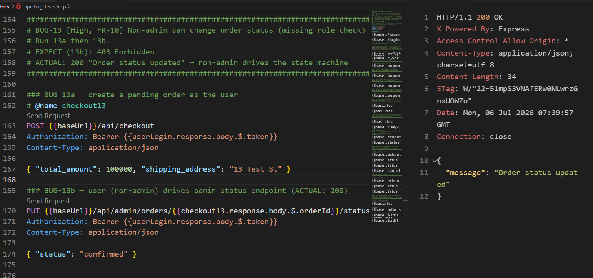
- **Traceability:** `FR10-SEC-01` (auto — non-admin drove status to `confirmed`, got 200).

---

### Probe findings worth escalating (not filed)
- **Silent no-op:** deleting a non-existent / non-numeric category id returns `200 "Category
  deleted"` (`FR14-DT-08`, `FR14-BVA-14`).
